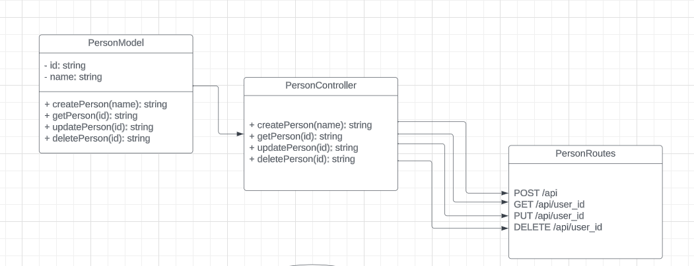
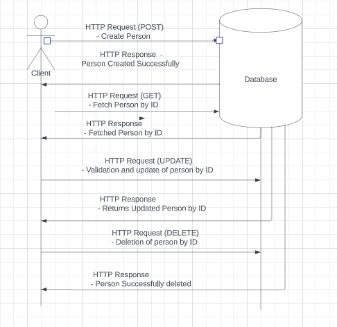

UML Diagrams



> > > > > > > > > >

FlowChart

> > > > > > >



Controllers Documentation
This document provides detailed information about the controllers used in the project. Controllers are responsible for handling HTTP requests and controlling the flow of data between the routes and the models.

Table of Contents

1. Create Person
2. Get Person
3. Update Person
4. Delete Person

> > > > > > > > > > > > > > > > > > > > > > >

1. Create Person
   Endpoint: `/api`
   HTTP Method: `POST`

Description:
This controller is responsible for creating a new person entry in the database.

Request Body:

- `name` (String): The name of the person to be created.
  Request Example:

```javascript
{
  "name": "Mark Essien"
}
```

Response:

- `success` (Boolean): Indicates the success of the operation.
- `message` (String): Describes the result of the operation.
- `data` (Object): Contains the created person object.

Response Example (Success):

```javascript
{
    "success": true,
    "message": "Person created successfully",
    "data": {
        "name": "Mark Essien",
        "_id": "65001e3b787cc14e55c256ef",
        "__v": 0
    }
}
```

Response Example (Error):

```javascript
{
  "success": false,
  "message": "Name must be provided"
}
```

2. Get Person
   Endpoint: `/api/:user_id`
   HTTP Method: `GET`

Description:
This controller is responsible for retrieving a person's information by their unique user_id.

Request Parameters:

- `user_id` (String): The unique identifier of the person to be retrieved.
  Response:

- Person object if found.
- Error message if not found.

Response Example (Success):

```javascript
{
    "_id": "65001e3b787cc14e55c256ef",
    "name": "Mark Essien",
    "__v": 0
}
```

Response Example (Error):

```javascript
{
  "error": "Person not found"
}
```

3. Update Person
   Endpoint: `/api/:user_id`
   HTTP Method: `PUT`

Description:
This controller is responsible for updating a person's information by their unique user_id.

Request Parameters:

- `user_id` (String): The unique identifier of the person to be updated.

Request Body:

- Any field(s) of the person object that need to be updated.

Request Example:

```javascript
{
    "name": "Mark Owen",
    "address": "Lagos",
    "track": "Backend"
}
```

Response:

- `success` (Boolean): Indicates the success of the operation.
- `message` (String): Describes the result of the operation.
- `update` (Object): Contains the updated person object.

```javascript
{
    "success": true,
    "message": "Person successfully updated",
    "update": {
        "_id": "64ff472b71c84f591b2062fe",
        "name": "Mark Owen",
        "__v": 0,
        "address": "Lagos",
        "track": "Backend"
    }
}
```

Response Example (Error):

```javascript
{
  "success": false,
  "message": "All fields in the request body must be strings"
}
```

4. Delete Person
   Endpoint: `/api/:user_id`
   HTTP Method: `DELETE`

Description:
This controller is responsible for deleting a person's information by their unique user_id.

Request Parameters:

- `user_id` (String): The unique identifier of the person to be deleted.

Response:

- `success` (Boolean): Indicates the success of the operation.
- `message` (String): Describes the result of the operation.

Response Example (Success):

```javascript
{
    "success": true,
    "message": "Person successfully deleted"
}
```

Response Example (Error):

```javascript
{
  "success": false,
  "message": "Person entry not found"
}
```
